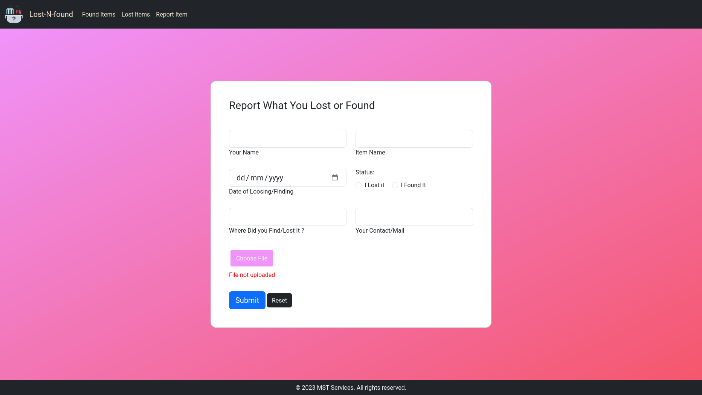
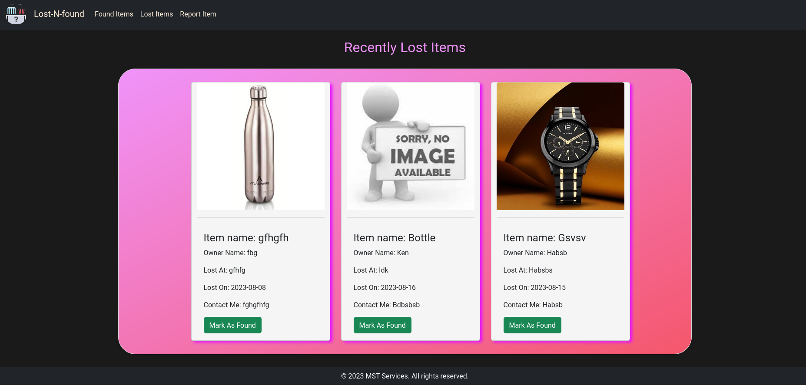
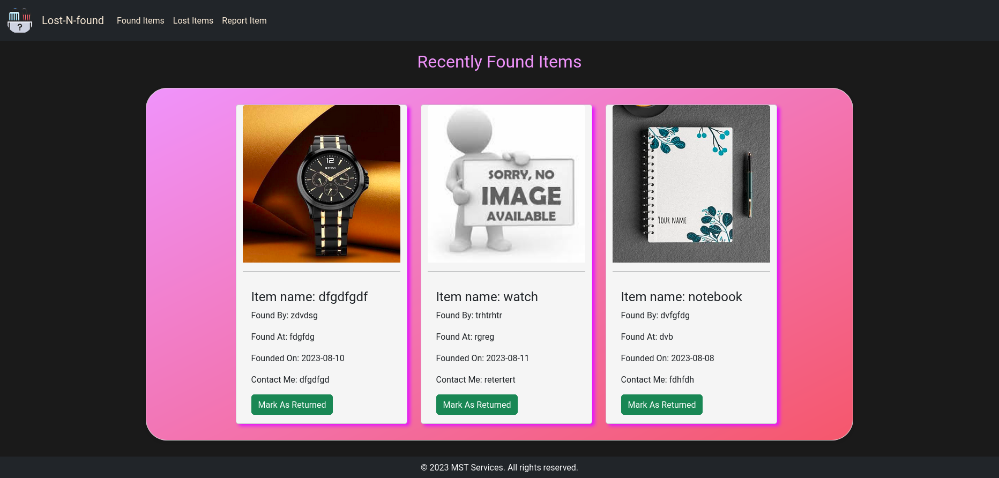

# College Lost and Found Website

## Description

The College Lost and Found Website is a user-friendly platform designed to help college students and staff report lost items and discover found items. The website is built using Flask for the server backend, and it utilizes HTML, JavaScript, and CSS for the frontend.

## Features

- **Lost Item Reporting:** Users can easily report lost items by filling out a form with relevant details such as item description, contact information, and location.

- **Found Item Posting:** Users can post details about found items, including item description, contact information, and location. Found items are displayed in a dedicated section.

- **NO Login Needed:** To post data no login Is needed By the USER at all.

- **User-Friendly Interface:** The frontend is designed with user experience in mind, making it intuitive and easy to navigate.

## Installation

1. Clone the repository: `git clone https://github.com/dhimanparas20/lostNfound.git`
2. Navigate to the project directory: `cd lostAndFound`
3. Install dependencies: `pip install -r requirements.txt`
4. Run the Flask development server: `flask run`

## Usage

1. Access the website by opening your browser and navigating to `http://localhost:5000`.
2. Use the provided forms to report lost items or post found items.
3. Explore the lost and found sections to discover items reported by others.
4. Utilize search and filtering options to narrow down the list of items.

## Screenshots

## Credits

- Developed by Paras Dhiman

## License

This project is licensed under the [MIT License](LICENSE).
